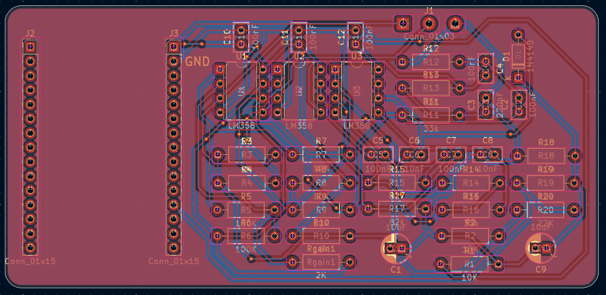
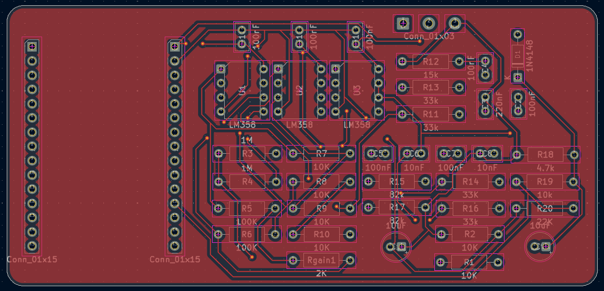
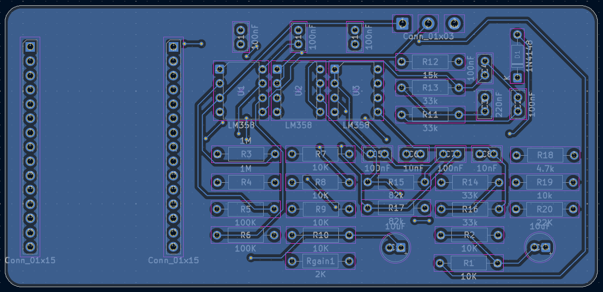
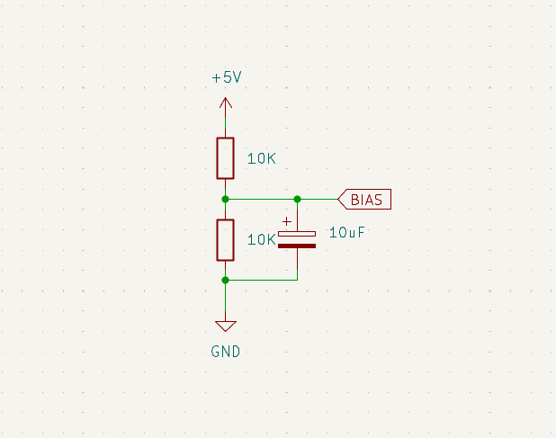
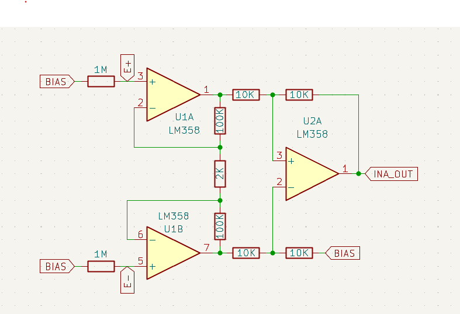
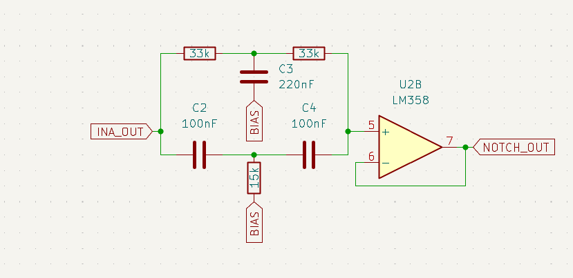
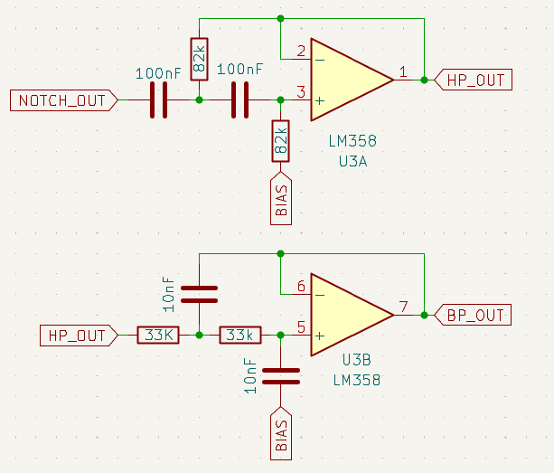
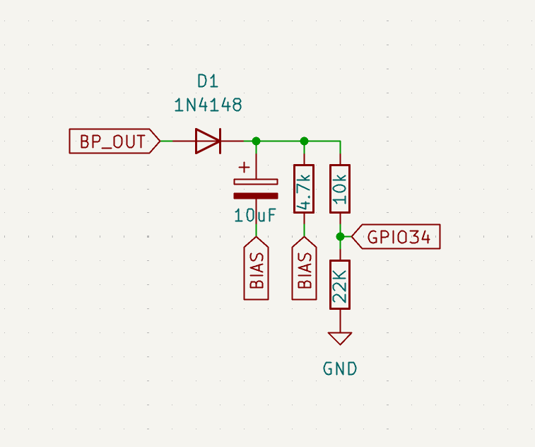

## System Overview

The MyoRead is an EMG sensor made up of a four-stage analog circuit that picks up the tiny electrical signals your muscles give off when they contract and cleans them up enough for a computer to read. It's built around the cheap, everyday LM358P op-amp to keep costs down.

```
Forearm electrodes 
      |
      v
[Stage 1] Instrumentation Amplifier   -- 101x gain, rejects common-mode noise
      |
      v
[Stage 2] Twin-T 50 Hz Notch Filter   -- kills UAE mains hum
      |
      v
[Stage 3] Sallen-Key Bandpass 20-500 Hz -- isolates EMG band
      |
      v
[Stage 4] Half-wave rectifier + RC envelope (tau = 47 ms)
```
<p align="center">
   
</p>
<p align="center">
  
 
</p>

## Signal Chain

All op-amp stages use the **LM358P** (DIP-8, single supply 5 V).

The LM358P output swings only 0.05 V to 3.5 V on a 5 V supply. A 2.5 V DC bias is applied at every stage input so the AC signal can swing symmetrically without clipping.

### Stage 0 -- Bias circuit

Two matched 10 kohm resistors from 5 V to GND. Midpoint = 2.5 V.

```
V_bias = 5V x R2 / (R1 + R2) = 5V x 10k / 20k = 2.5 V
```
<p>
   
</p>

### Stage 1 - 3-op-amp instrumentation amplifier

```
Gain = 1 + (2 x Rf / Rg) = 1 + (2 x 100k / 2k) = 101x
```

- Rf = 100 kohm x2 (feedback around OA1, OA2)
- Rg = 2 kohm (single resistor between OA1 IN- and OA2 IN-)
- OA3 difference amplifier: 4 matched 10 kohm resistors

CMRR depends on matching the four OA3 resistors. Select four from the kit using a multimeter: target within 1% of each other.

<p>
   
</p>

### Stage 2 - Twin-T 50 Hz notch filter

```
f_notch = 1 / (2pi x R x C)
R = 1 / (2pi x 50 x 100nF) = 31.8 kohm --> 33 kohm (E24 standard)
Centre resistor: R/2 = 15 kohm
Centre capacitor: 2C = 220 nF
Actual f_notch with 33 kohm: 48.2 Hz -- effective against 50 Hz hum
```

Followed by a unity-gain op-amp buffer to restore drive capability.

<p>
   
</p>

### Stage 3 - Sallen-Key bandpass 20-500 Hz

High-pass (20 Hz):
```
C = 100 nF
R = 1 / (2pi x 20 x 100nF) = 79.6 kohm --> 82 kohm
Actual cutoff: 19.4 Hz
```

Low-pass (500 Hz):
```
C = 10 nF
R = 1 / (2pi x 500 x 10nF) = 31.8 kohm --> 33 kohm
Actual cutoff: 482 Hz
```

<p>
   
</p>

### Stage 4 - Envelope detector

```
Half-wave rectifier: 1N4148 signal diode (stripe = cathode, faces output)
RC smoother: R = 4.7 kohm, C = 10 uF electrolytic
tau = R x C = 4700 x 0.00001 = 47 ms

Constraint: 1/500Hz = 2ms << tau << 1/20Hz = 50ms  (satisfied)
```
<p>
   
</p>

The output is a slowly-varying DC voltage proportional to muscle activation level. This feeds directly into your  microcontroller.


## Electrode placement

```
FOREARM (palm facing up, elbow left, wrist right)

+------------------------------------------+
|  ELBOW <----------------------- WRIST    |
|                                          |
|  [IN+]  [IN-]                   [REF]    |
|  2-3 cm apart, over muscle belly  bony   |
|  (inner forearm, palm side)       bump   |
+------------------------------------------+
```

- IN+ and IN- over the forearm flexor muscle belly, 2-3 cm apart along the muscle fibre direction
- REF on the bony wrist prominence (styloid process) -- no muscle underneath, picks up noise only

Skin prep: alcohol wipe, apply conductive gel under each pad. Target skin impedance below 10 kohm between electrodes.

## Bill Of Materials

| Component | Manufacturer Part Number | Description | Quantity |
|-----------|--------------------------|-------------|---------:|
| 10 kΩ Resistor | MFR-25FRF52-10K | RES 10K OHM 1% 1/4W AXIAL | 10 |
| 33 kΩ Resistor | MFR-25FTE52-33K | RES 33K OHM 1% 1/4W AXIAL | 10 |
| 1 MΩ Resistor | MFR-25FRF52-1M | RES 1M OHM 1% 1/4W AXIAL | 2 |
| 100 kΩ Resistor | MFR-25FBF52-100K | RES 100K OHM 1% 1/4W AXIAL | 2 |
| 82 kΩ Resistor | MFR-25FBF52-82K | RES 82K OHM 1% 1/4W AXIAL | 2 |
| 15 kΩ Resistor | MFR-25FBF52-15K | RES 15K OHM 1% 1/4W AXIAL | 1 |
| 4.7 kΩ Resistor | MFR-25FTE52-4K7 | RES 4.7K OHM 1% 1/4W AXIAL | 1 |
| 22 kΩ Resistor | MFR-25FTE52-22K | RES 22K OHM 1% 1/4W AXIAL | 1 |
| Signal Diode | 1N4148 | DIODE STANDARD 100V 200MA DO35 | 1 |
| Operational Amplifier | LM358P | IC OPAMP GP 2 CIRCUIT 8DIP | 3 |
| 2 kΩ Resistor | MFR-25FBF52-2K | RES 2K OHM 1% 1/4W AXIAL | 1 |
| 100 nF Ceramic Capacitor | K104K15X7RF5TL2 | CAP CER 0.1µF 50V X7R RADIAL | 10 |
| 10 nF Ceramic Capacitor | A103K15X7RF5TAA | CAP CER 10000PF 50V X7R AXIAL | 2 |
| 10 µF Electrolytic Capacitor | 50YXJ10M5X11 | CAP ALUM 10µF 20% 50V RADIAL TH | 2 |
| 220 nF Ceramic Capacitor | FG14X7R1H224KNT00 | CAP CER 0.22µF 50V X7R RADIAL | 1 |